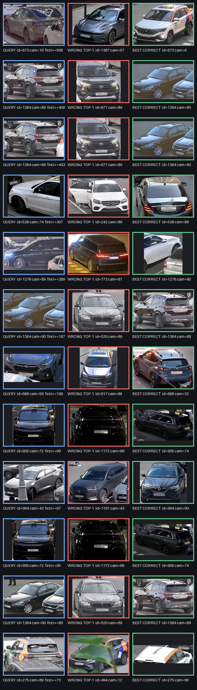

# Error analysis финального speed-профиля

## Область анализа

Анализ выполнен внутри release Docker-образа на пяти зафиксированных validation
протоколах (`101, 211, 307, 401, 503`). Для каждого протокола из каждой пары
`vehicle_id × camera_id` случайно, но детерминированно выбирается один gallery
кадр; остальные изображения становятся query. Такой срез проверяет не один
удачный состав gallery, а устойчивость к выбору её представителей.

`vehicle_id` и `camera_id` используются только для офлайн-оценки. Release
inference их не получает. Машиночитаемый отчёт находится в
`outputs/score_optimized_speed/error_analysis.json`, генератор —
`scripts/analyze_release_errors.py`.

## Итоговые показатели

| Показатель | Значение |
|---|---:|
| Число оценённых query по пяти эпизодам | 5 670 |
| mAP@10 | 0.836126 |
| Rank-1 | 0.804762 |
| Rank-5 | 0.926279 |
| Rank-10 | 0.957319 |
| Ошибки Rank-1 | 1 107 |

Разложение ошибок Rank-1:

- 689 случаев (62.2% Rank-1 ошибок) имеют правильный ответ на позициях 2–5;
- 176 случаев (15.9%) имеют правильный ответ на позициях 6–10;
- 242 случая (21.9%) не имеют правильного ответа в top-10;
- 170 изображений стабильно ошибочны во всех эпизодах, в которых встречаются.

Следовательно, основная оставшаяся возможность улучшения — более точное
переупорядочивание короткого списка. Примерно пятая часть ошибок требует уже
улучшения первого этапа retrieval, а не только reranker.

## Размер объекта

| Квартиль площади BBox относительно кадра | mAP@10 | Rank-1 | Rank-5 |
|---|---:|---:|---:|
| Самые маленькие | 0.800985 | 0.760395 | 0.905567 |
| Маленькие | 0.856878 | 0.824153 | 0.947740 |
| Крупные | 0.834897 | 0.800988 | 0.912491 |
| Самые крупные | 0.851796 | 0.833568 | 0.939351 |

Самые маленькие автомобили дают на 7.3 процентного пункта меньше Rank-1, чем
самые крупные. Вероятные причины — меньше деталей кузова после resize,
компрессия, фон и перекрытия занимают большую часть признака.

## Визуальная проверка

Монтаж содержит наиболее тяжёлые ошибки первого locked seed. Синим обозначен
query, красным — ошибочный top-1, зелёным — первый правильный кандидат.

Наблюдаемые группы ошибок:

1. **Сильная смена ракурса.** Передняя, задняя и боковая проекции одного
   автомобиля иногда различаются сильнее, чем одинаковые проекции разных машин.
2. **Малый размер, перекрытия и обрезка.** В кадре остаются фрагмент крыши,
   капота или боковины; часть BBox занята соседним автомобилем или человеком.
3. **Сложное освещение.** Ночные и тёмные кадры меняют цвет, контраст и
   видимость локальных деталей.
4. **Похожие кузова и цвет.** Ошибочный кандидат часто совпадает по классу,
   цвету и общему силуэту, но отличается мелкими элементами.
5. **Изменение внешнего оформления.** Реклама, такси-ливрея и декоративные
   элементы могут присутствовать только на одном ракурсе.
6. **Потенциально неоднозначные annotation-группы.** В нескольких наиболее
   тяжёлых случаях изображения с одним `vehicle_id` визуально похожи на разные
   модели. Это не объявляется ошибкой разметки без проверки владельцем данных,
   но такие пары нельзя честно интерпретировать только как ошибку модели.

## Что уже снижает эти ошибки

- OSNet, DINOv2 и ConvNeXt дают взаимодополняющие глобальные признаки;
- DINO patch matching и локальные part descriptors помогают при смене ракурса;
- family GNN и gallery-only связи используют повторные изображения внутри
  статической gallery, не обращаясь к другим test query;
- top-25/top-50 reranker исправляет значительную часть ошибок первого этапа;
- open-set policy умеет отказаться от слабого top-1 вместо принудительного
  кандидата.

## Безопасные следующие улучшения

1. Обучить отдельную ветвь для малых объектов с более высоким разрешением или
   distillation, контролируя официальный latency.
2. Усилить view-aware part matching на train-камерах, не используя camera ID в
   inference.
3. Обучать top-K reranker именно на 689 типичных «правильный ответ уже в 2–5»
   случаях с identity-disjoint OOF.
4. Перед обучением проверить потенциально неоднозначные identity-группы и не
   исправлять их автоматически.
5. Повторять анализ на всех locked seeds и принимать изменение только при
   стабильном выигрыше mAP, а не на одном примере.

## Ограничения вывода

- Это локальная identity-disjoint validation, а не закрытый тест.
- Разбиение по размеру показывает корреляцию, но не доказывает причинность.
- Камеры применяются только для официального junk mask и анализа, поэтому
  выводы нельзя превращать в test camera prior.
- Номерные знаки намеренно не анализируются и не используются моделью.
